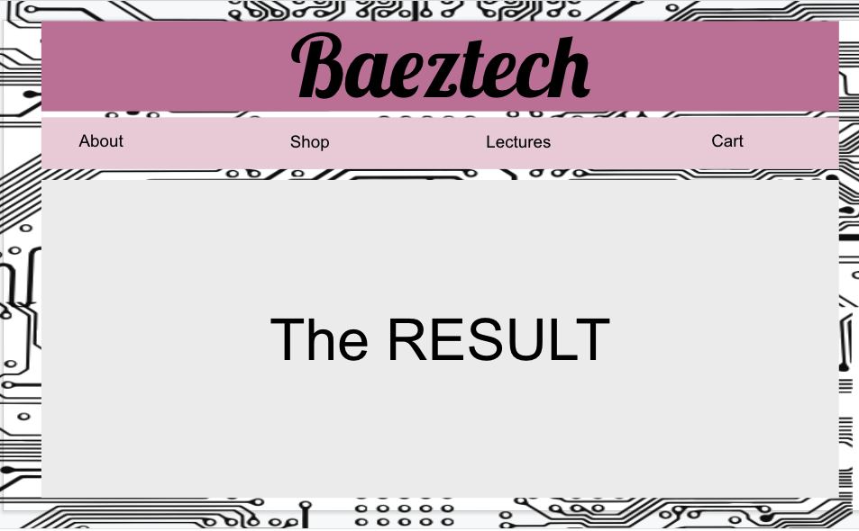

# Basic CSS Web Page

---

Create a Web page that uses an inline or external style sheet to look like the following example.

Your Web Page should contain the following:
* An external or internal style sheet
* Styles for the following tags:
  * P 
  * Body
  * h1
* TO space the elements out use the CSS Reference from w3 schools

## Ways to approach this:

Understand the problem:
_the problem is to create a page identical to the image provided_

Come up with a plan:
_Start by framing out the content first using paragraphs and headers_

_Proceed by making each of the components have a style. An issue you will have is that the components will all look the same, we will fix this in the coming days with new tags._

